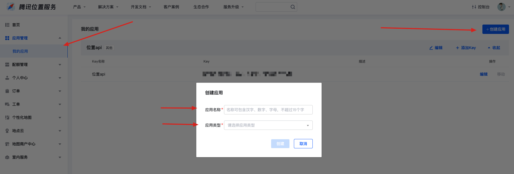
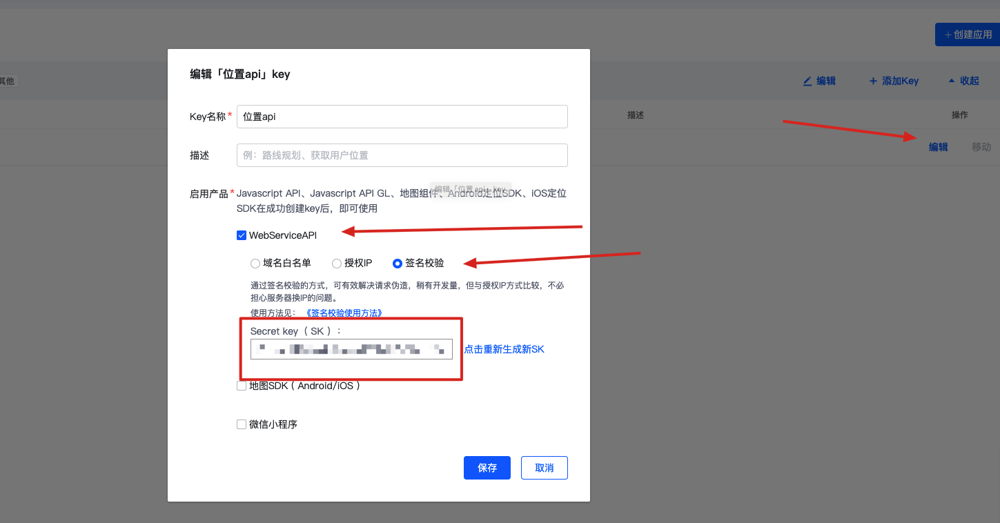

## 注册腾讯位置
打开 https://lbs.qq.com/ 
然后注册账号登录进去
## 创建应用
然后进入 **控制台**，点击左边的应用管理 -> 我的应用
输出应该相关信息，随便填

## 获取应用 KEY 和签名 SK
创建好应用后，就可以看到**应用的 KEY** 了

点击应用右边的**编辑**按钮，然后选择 **WebServiceAPI**，选择**签名校验**
就可以得到**签名的 SK** 了
